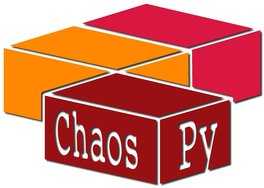

Chaospy
=======

|travis| |codecov| |pypi| |readthedocs|

|logo|

Chaospy is a numerical tool for performing uncertainty quantification using
polynomial chaos expansions and advanced Monte Carlo methods implemented in
Python 2 and 3.

A article in Elsevier Journal of Computational Science has been published
introducing the software: `here
<http://dx.doi.org/10.1016/j.jocs.2015.08.008>`_.  If you are to use this
software in work that is published, please cite this paper.

Installation
------------

Installation should be straight forward::

    pip install chaospy

From Source
~~~~~~~~~~~

Alternativly, to get the most current version, the code can be installed from
github as follows::

    git clone git@github.com:jonathf/chaospy.git
    cd chaospy
    pip install -r requirements.txt
    python setupy.py install

The last command might need ``sudo`` prefix, depending on your python setup.

Optional Packages
~~~~~~~~~~~~~~~~~

Optionally, to support more regression methods, install the Scikit-learn
package::

    pip install scikit-learn

Example Usage
-------------

``chaospy`` is created to be simple and modular. A simple script to implement
point collocation method will look as follows::

    >>> import chaospy as cp
    >>> import numpy as np

    >>> def foo(coord, prm): # your code wrapper goes here
    ...     return prm[0] * np.e ** (-prm[1] * np.linspace(0, 10, 100))

    >>> distribution = cp.J(
    ...     cp.Uniform(1, 2),
    ...     cp.Uniform(0.1, 0.2)
    ... )

    >>> polynomial_expansion = cp.orth_ttr(8, distribution)

    >>> foo_approx = cp.fit_regression(
    ...     polynomial_expansion, samples, evals)

    >>> expected = cp.E(foo_approx, distribution)
    >>> deviation = cp.Std(foo_approx, distribution)

For a more extensive description of what going on, see the `tutorial
<http://chaospy.readthedocs.io/en/master/tutorial.html>`_. For a collection of
reciepies, see the `cookbook
<http://chaospy.readthedocs.io/en/master/cookbook.html>`_.

Testing
-------

To test the build locally::

    pip install -r requirements-dev.txt
    python setup.py test

It will run ``pytest-runner`` and execute all tests.

Questions & Troubleshooting
---------------------------

For any problems and questions you might have related to ``chaospy``, please
feel free to file an `issue <https://github.com/jonathf/chaospy/issues>`_.

.. |travis| image:: https://travis-ci.org/jonathf/chaospy.svg?branch=master
    :target: https://travis-ci.org/jonathf/chaospy
.. |codecov| image:: https://codecov.io/gh/jonathf/chaospy/branch/master/graph/badge.svg
    :target: https://codecov.io/gh/jonathf/chaospy
.. |pypi| image:: https://img.shields.io/pypi/v/chaospy.svg
    :target: https://pypi.python.org/pypi/chaospy
.. |readthedocs| image:: https://readthedocs.org/projects/chaospy/badge/?version=master
    :target: http://chaospy.readthedocs.io/en/master/?badge=master

