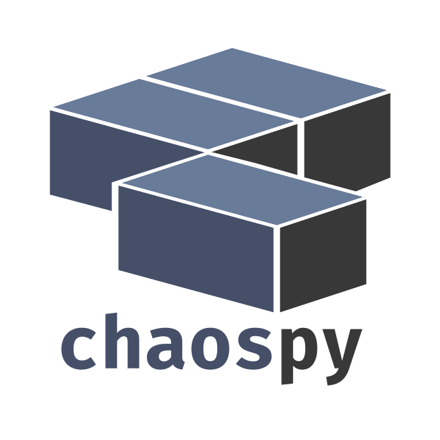

|circleci| |codecov| |pypi| |readthedocs|

.. |circleci| image:: https://circleci.com/gh/jonathf/chaospy/tree/master.svg?style=shield
    :target: https://circleci.com/gh/jonathf/chaospy/tree/master
.. |codecov| image:: https://codecov.io/gh/jonathf/chaospy/branch/master/graph/badge.svg
    :target: https://codecov.io/gh/jonathf/chaospy
.. |pypi| image:: https://badge.fury.io/py/chaospy.svg
    :target: https://badge.fury.io/py/chaospy
.. |readthedocs| image:: https://readthedocs.org/projects/chaospy/badge/?version=master
    :target: http://chaospy.readthedocs.io/en/master/?badge=master

Chaospy is a numerical tool for performing uncertainty quantification using
polynomial chaos expansions and advanced Monte Carlo methods implemented in
Python 2 and 3.

If you are using this software in work that will be published, please cite the
journal article: `Chaospy: An open source tool for designing methods of
uncertainty quantification <http://dx.doi.org/10.1016/j.jocs.2015.08.008>`_

.. contents:: Table of Contents:

Installation
------------

Installation should be straight forward::

    pip install chaospy

And you should be ready to go.

Alternatively, to get the most current experimental version, the code can be
installed from Github as follows::

    git clone git@github.com:jonathf/chaospy.git
    cd chaospy
    git checkout <tag or branch of interest>
    pip install .

Example Usage
-------------

``chaospy`` is created to be simple and modular. A simple script to implement
point collocation method will look as follows:

.. code-block:: python

    import chaospy
    import numpy

    # your code wrapper goes here
    def foo(coord, prm):
        """Function to do uncertainty quantification on."""
        return prm[0] * numpy.e ** (-prm[1] * numpy.linspace(0, 10, 100))

    # bi-variate probability distribution
    distribution = chaospy.J(chaospy.Uniform(1, 2), chaospy.Uniform(0.1, 0.2))

    # polynomial chaos expansion
    polynomial_expansion = chaospy.orth_ttr(8, distribution)

    # samples:
    samples = distribution.sample(1000)

    # evaluations:
    evals = [foo(sample) for sample in samples.T]

    # polynomial approximation
    foo_approx = chaospy.fit_regression(
        polynomial_expansion, samples, evals)

    # statistical metrics
    expected = chaospy.E(foo_approx, distribution)
    deviation = chaospy.Std(foo_approx, distribution)

For a more extensive description of what going on, see the `tutorial
<https://chaospy.readthedocs.io/en/master/tutorial.html>`_.

For a collection of recipes, see the `cookbook
<https://chaospy.readthedocs.io/en/master/cookbook.html>`_.

Related Projects
----------------

Chaospy is being used in other related projects that requires uncertainty
quantification components ``chaospy`` provides.

+-----------------+-----------------------------------------------------------+
| `easyVVUQ`_     | Library designed to facilitate verification, validation   |
|                 | and uncertainty quantification.                           |
+-----------------+-----------------------------------------------------------+
| `STARFiSh`_     | Shell-based, scientific simulation program                |
|                 | for blood flow in mammals.                                |
+-----------------+-----------------------------------------------------------+
| `Profit`_       | Probabilistic response model fitting via interactive      |
|                 | tools.                                                    |
+-----------------+-----------------------------------------------------------+
| `UncertainPy`_  | Uncertainty quantification and sensitivity analysis,      |
|                 | tailored towards computational neuroscience.              |
+-----------------+-----------------------------------------------------------+

.. _easyVVUQ: https://github.com/UCL-CCS/EasyVVUQ
.. _STARFiSh: https://www.ntnu.no/starfish
.. _Profit: https://github.com/redmod-team/profit
.. _UncertainPy: https://github.com/simetenn/uncertainpy

Also a few shout-outs:

+--------------+--------------------------------------------------------------+
| `OpenTURNS`_ | Thanks to `Régis Lebrun`_ for both proposing a collaboration |
|              | and creating an initial implementation of both               |
|              | `Chaospy Compatibility`_ in `OpenTURNS`_ and                 |
|              | `OpenTURNS Compatibility`_ in ``chaospy``.                   |
+--------------+--------------------------------------------------------------+
| `orthopy`_   | Thanks to `Nico Schlömer`_ for providing the implementation  |
| `quadpy`_    | for several of the quadrature integration methods.           |
+--------------+--------------------------------------------------------------+
| ``UQRF``     | Thanks to `Florian Künzner`_ for providing the               |
|              | implementation for `sample distribution`_.                   |
+--------------+--------------------------------------------------------------+

.. _OpenTURNS: http://openturns.github.io/openturns/latest
.. _Régis Lebrun: https://github.com/regislebrun
.. _Chaospy Compatibility: http://openturns.github.io/openturns/latest/user_manual/_generated/openturns.ChaospyDistribution.html
.. _OpenTURNS Compatibility: https://chaospy.readthedocs.io/en/master/recipes/external.html#module-chaospy.external.openturns_
.. _orthopy: https://github.com/nschloe/orthopy
.. _quadpy: https://github.com/nschloe/quadpy
.. _Nico Schlömer: https://github.com/nschloe
.. _Florian Künzner: https://github.com/flo2k
.. _sample distribution: https://chaospy.readthedocs.io/en/master/recipes/external.html#module-chaospy.external.samples

Questions & Troubleshooting
---------------------------

For any problems and questions you might have related to ``chaospy``, please
feel free to file an `issue <https://github.com/jonathf/chaospy/issues>`_.
