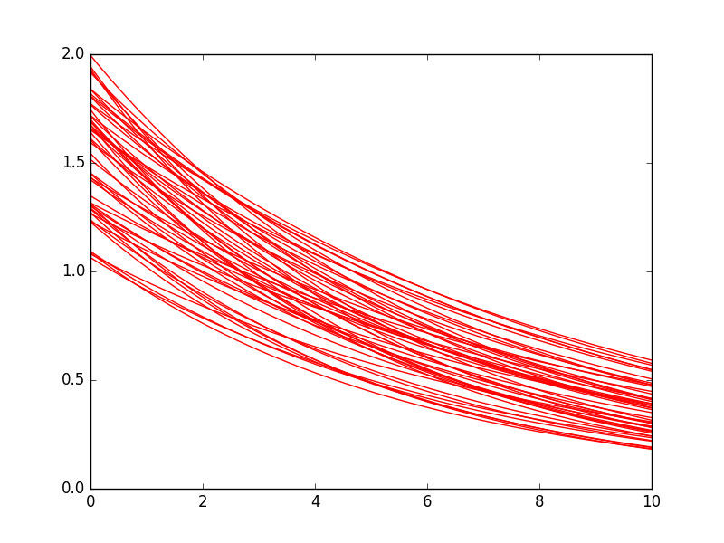

.. _tutorial:

Tutorial
--------

The software library ``chaospy`` is ment to be used together with the standard
library ``numpy``. To distinguish between the two, both are imported into the
name space and for simplicity is abbrivated as follows::

    >>> import chaospy as cp
    >>> import numpy as np

First we start by defining a model function. Let us call ``foo(coord, param)``
which we in general assume is a wrapper for some larger numerical solver, but
for the sake of demonstration, let the model be defined analytically as an
exponential function::

    >>> def foo(coord, param):
    ...     return param[0] * np.e ** (-param[1] * coord)

Here ``coord`` are temporal coordinates in one dimensions, and ``param`` consists
of two model parameters that defines the shape of the solution. We furthermore
assume that the ``coord`` defined on the interval ``(0, 1)``::

    >>> coord = np.linspace(0, 10, 200)

And assume that ``param`` is unknown, but can be described through a joint
probability distribution::

    >>> distribution = cp.J(
    ...     cp.Uniform(1, 2),
    ...     cp.Uniform(0.1, 0.2)
    ... )

To visualize the variability in the model we generate 10 samples from the
distribution which we then use to evaluate the model::

    >>> samples = distribution.sample(50)
    >>> evals = [foo(coord, sample) for sample in samples.T]

    50 sample evaluations of an exponential function with uncertain initial
    conditions and rate.

Our goal is therefore to describe the bahavior of ``foo`` with only having
a blackbox evaluation function of ``foo`` available. For this tutorial, let us
only focus on expected value :func:`~chaospy.descriptives.E` and standard
deviation :func:`~chaospy.descriptives.Std`.  In ``chaospy`` there are three
classes of methods available for performing this task: :ref:`montecarlo`,
:ref:`regression` and :ref:`spectral`.

.. seealso::
    :ref:`descriptives`,
    :ref:`distributions`

Monte Carlo simulation
~~~~~~~~~~~~~~~~~~~~~~

Performing Monte Carlo requires that one can create samples, from the input
distribution. In ``chaospy`` such samples can be generated each distributions
``sample`` methods, as noted above. To generate samples from psaudo-random
samples like e.g. ``Hammersley``, a flag in ``sample`` can be issued to indicate
the type of sample. For example::

    >>> samples = distribution.sample(1000, "H")
    >>> evals = [foo(coord, sample) for sample in samples.T]

These samples can then be used to do analysis using tools from the standard
``numpy`` library::

    >>> expected = np.mean(evals, 0)
    >>> deviation = np.std(evals, 0)

.. figure:: ./fig/results_montecarlo.png

    Expected value plus/minus standard deviation.

.. seealso::
    :ref:`montecarlo`,
    :ref:`distributions`

Point Collocation method
~~~~~~~~~~~~~~~~~~~~~~~~

The simpler of the two non-intrusive polynomial chaos expansion methods is the
point collocation method. It builds upon the idea of fitting a polynomial to
the samples generated in the Monte Carlo simulation step.

For example, to generate a 8th order polynomial and fit it to the 1000 samples
generated, the following steps can be employed. First an expansion to be fitted
must be generated::

    >>> polynomial_expansion = cp.orth_ttr(8, distribution)

Here we choose the polynomial expansion to be orthogonal, but for point
collocation method, this is not a strict requirement.

With the samples, evaluations and polynomial expansion available, an polynomial
approximation can be created using a regression method::

    >>> foo_approx = cp.fit_regression(
    ...     polynomial_expansion, samples, evals)

With the approximation available, analysis can be done using tools from the
:ref:`descriptives` collection::

    >>> expected = cp.E(foo_approx, distribution)
    >>> deviation = cp.Std(foo_approx, distribution)

.. figure:: ./fig/results_collocation.png

    Expected value plus/minus standard deviation. For smooth problems, these
    results are expected to be more accurate than Monte Carlo.

.. seealso::
    :ref:`descriptives`,
    :ref:`orthogonality`,
    :ref:`polynomials`,
    :ref:`regression`

Pseudo-spectral Projection method
~~~~~~~~~~~~~~~~~~~~~~~~~~~~~~~~~

The second non-intrusive polynomial chaos expansion method involves calculating
the Fourier coefficients using numerical integration techniques.  Unless the
integration technique is Monte Carlo integration (in which the method defaults
back to point collocation), the samples from the Monte Carlo simulation can not
be reused. Instead new samples from a fitting integration scheme must be
employed.

For example, to generate 8th order absissas and weights for the Clenshaw-Curtis
method::

    >>> absissas, weights = cp.generate_quadrature(
    ...     order=8, domain=distribution, rule="C")

These can then be used to create an polynomial approximation as follows::

    >>> evals = [foo(coord, val) for val in absissas.T]
    >>> foo_approx = cp.fit_quadrature(
    ...     polynomial_expansion, absissas, weights, evals)

The expected value and variance is calculated as before::

    >>> expected = cp.E(foo_approx, distribution)
    >>> deviation = cp.Std(foo_approx, distribution)

    Expected value plus/minus standard deviation. For very smooth problems,
    these results are expected to be more accurate than both Monte Carlo and
    point collocation method.

.. seealso::
    :ref:`descriptives`,
    :ref:`orthogonality`,
    :ref:`polynomials`,
    :ref:`quadrature`
