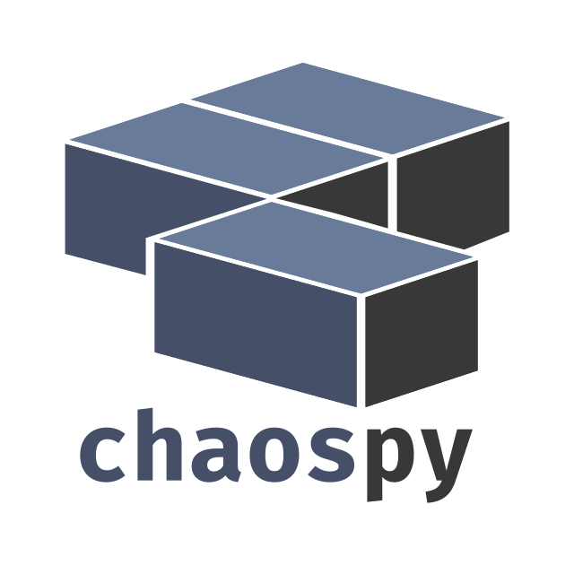
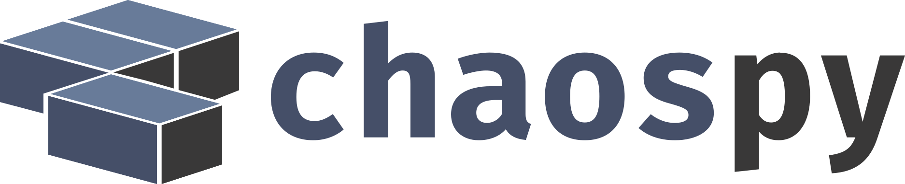
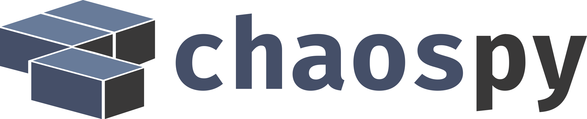

.. _about_us:

About us
========

Chaospy was created by Hans Petter Langtangen and Jonathan Feinberg in
2011-2012, as a need to solve some problems related to Jonathan's doctoral
work. The paper outlining chaospy was published in 2015. It has since been
continued to be developed by Jonathan with some help here and there by others.
In 2019 the polynomial class we split out into `numpoly
<https://github.com/jonathf/numpoly>`_.

Questions
---------

Please feel free to file `an issue
<https://github.com/jonathf/chaospy/issues>`_ for any of the following reasons:

* bug reporting
* asking questions related to usage
* requesting new features

Related projects
----------------

A few shout-outs to people who have contributed to the Chaospy project:

+--------------+--------------------------------------------------------------+
| `OpenTURNS`_ | Thanks to `Régis Lebrun`_ for both proposing a collaboration |
|              | and creating an initial implementation of both               |
|              | `Chaospy Compatibility`_ in `OpenTURNS`_ and                 |
|              | `OpenTURNS Compatibility`_ in ``chaospy``.                   |
+--------------+--------------------------------------------------------------+
| `orthopy`_   | Thanks to `Nico Schlömer`_ for providing the implementation  |
| `quadpy`_    | for several of the quadrature integration methods.           |
+--------------+--------------------------------------------------------------+
| ``UQRF``     | Thanks to `Florian Künzner`_ for providing the initial       |
|              | implementation of kernel density estimation and              |
|              | quantity-of-interest distribution.                           |
+--------------+--------------------------------------------------------------+

.. _OpenTURNS: http://openturns.github.io/openturns/latest
.. _Régis Lebrun: https://github.com/regislebrun
.. _Chaospy Compatibility: http://openturns.github.io/openturns/latest/user_manual/_generated/openturns.ChaospyDistribution.html
.. _OpenTURNS Compatibility: https://chaospy.readthedocs.io/en/master/recipes/external.html#module-chaospy.external.openturns_
.. _orthopy: https://github.com/nschloe/orthopy
.. _quadpy: https://github.com/nschloe/quadpy
.. _Nico Schlömer: https://github.com/nschloe
.. _Florian Künzner: https://github.com/flo2k

Chaospy is being used in other related projects that requires uncertainty
quantification components ``chaospy`` provides. For example:

+-----------------+-----------------------------------------------------------+
| `easyVVUQ`_     | Library designed to facilitate verification, validation   |
|                 | and uncertainty quantification.                           |
+-----------------+-----------------------------------------------------------+
| `STARFiSh`_     | Shell-based, scientific simulation program                |
|                 | for blood flow in mammals.                                |
+-----------------+-----------------------------------------------------------+
| `Profit`_       | Probabilistic response model fitting via interactive      |
|                 | tools.                                                    |
+-----------------+-----------------------------------------------------------+
| `UncertainPy`_  | Uncertainty quantification and sensitivity analysis,      |
|                 | tailored towards computational neuroscience.              |
+-----------------+-----------------------------------------------------------+
| `SparseSpACE`_  | Spatially adaptive combination technique targeted to      |
|                 | solve high dimensional numerical integration.             |
+-----------------+-----------------------------------------------------------+

.. _easyVVUQ: https://github.com/UCL-CCS/EasyVVUQ
.. _STARFiSh: https://www.ntnu.no/starfish
.. _Profit: https://github.com/redmod-team/profit
.. _UncertainPy: https://github.com/simetenn/uncertainpy
.. _SparseSpACE: https://github.com/obersteiner/sparseSpACE

For a more comprehensive list, see `Github's dependency graph
<https://github.com/jonathf/chaospy/network/dependents>`_.

Citations
---------

If you are going to publish work using this software, then please cite
:cite:`feinberg_chaospy_2015`.
In addition, if you deal with stochastic dependencies, please also cite
:cite:`feinberg_multivariate_2018`.

Brand marks
-----------

Please make use of the ``chaospy`` logos when preparing demonstrations
involving ``chaospy`` code.

Vertical SVG:

Vertical PNG:

Horizontal SVG:

Horizontal PNG:

