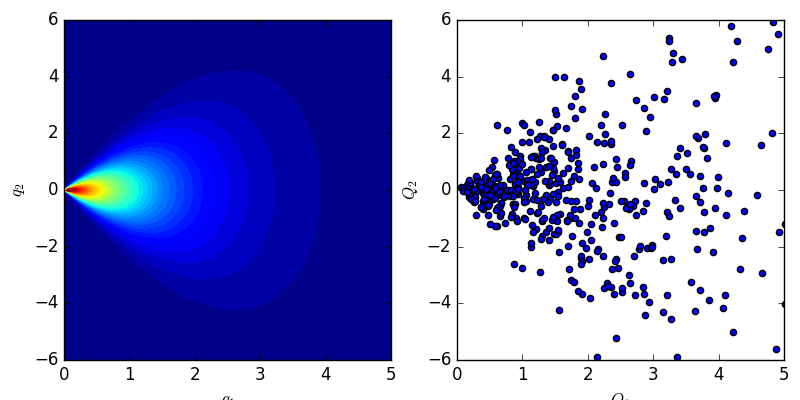

.. _distributions:

Probability Distributions
=========================

.. automodule:: chaospy.dist

.. autofunction:: chaospy.dist.J
.. autofunction:: chaospy.dist.Iid

Custom Constructions
--------------------

.. automodule:: chaospy.dist.backend

.. autoclass:: chaospy.dist.Dist
.. autofunction:: chaospy.dist.construct

Stocastically Dependent Variables
---------------------------------

.. automodule:: chaospy.dist.joint

Constructing advanced variables
-------------------------------

.. automodule:: chaospy.dist.graph

   Example of a custom construction with non-trivial dependent random
   variable.

.. autoclass:: chaospy.dist.graph.Graph
.. autoclass:: chaospy.dist.graph.Container
.. autoclass:: chaospy.dist.graph.Dists
.. autoclass:: chaospy.dist.graph.Keys
.. autoclass:: chaospy.dist.graph.Vals
