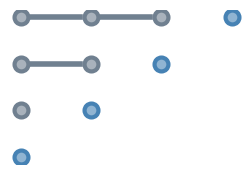
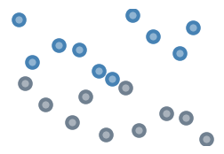
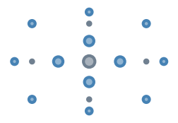

.. _user_guide:

User guide
==========

.. toctree::
    :hidden:

    chaos_expansion.rst
    distributions.rst
    sampling.rst
    quadrature.rst
    polynomial.rst
    orthogonality.rst
    descriptive.rst
    zbibliography.rst

The user guide covers most of ``chaospy`` by topic area. Each topic discusses
area of ``chaospy`` approaches the problem, with small examples along the way.

Some of the higher level topics however, are better shown through examples. So
check out the :ref:`tutorial` section as well.

The user guide is split into the following topics:

:ref:`chaos_expansion`
----------------------

+-----------------+-----------------------------------------------------------+
| |chaos|         | Overview over the fundamentals of using `chaospy` to make |
|                 | polynomial chaos expansions.                              |
+-----------------+-----------------------------------------------------------+

:ref:`distributions`
--------------------

+-----------------+-----------------------------------------------------------+
| |distribution|  | Representation of random variables through probability    |
|                 | density, cumulative distribution, moments, sampling, etc. |
+-----------------+-----------------------------------------------------------+

:ref:`sampling`
---------------

+-----------------+-----------------------------------------------------------+
| |sampling|      | Using random variables to create various forms of         |
|                 | (quasi-)random samples for the use of reducing            |
|                 | approximation errors.                                     |
+-----------------+-----------------------------------------------------------+

:ref:`polynomial`
-----------------

+-----------------+-----------------------------------------------------------+
| |polynomial|    | Creation, manipulation and representation of polynomials  |
|                 | and arrays of polynomials.                                |
+-----------------+-----------------------------------------------------------+

:ref:`orthogonality`
--------------------

+-----------------+-----------------------------------------------------------+
| |orthogonality| | Creation, manipulation and analysis of orthogonal         |
|                 | polynomials for use in model approximations.              |
+-----------------+-----------------------------------------------------------+

:ref:`quadrature`
-----------------

+-----------------+-----------------------------------------------------------+
| |quadrature|    | Quadrature rules for numerical integration.               |
+-----------------+-----------------------------------------------------------+

:ref:`descriptives`
-------------------

+-----------------+-----------------------------------------------------------+
| |descriptive|   | Descriptive statistics to analyze random variables and    |
|                 | polynomial approximations.                                |
+-----------------+-----------------------------------------------------------+

.. :ref:`recurrence`
.. -----------------

.. +-----------------+-----------------------------------------------------------+
.. | |recurrence|    | Various algorithms for constructing three terms           |
.. |                 | recurrence coefficients, which are essential for both     |
.. |                 | quadrature and orthogonal polynomial creation.            |
.. +-----------------+-----------------------------------------------------------+

